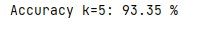

## Raport.pdf is a report in which I tested all the algorithms, described each of them and compared the results. You can also see the raport below, but Markdown files does not format the text & images well.

Stroke Prediction Dataset

źródło:
https://www.kaggle.com/datasets/fedesoriano/stroke-prediction-dataset

Baza zawiera 5110 rekordów z 12 atrybutami, na podstawie których
prognozujemy szanse, na wystąpienie zawału.

**Informacje o kolumnach:**

-   id: unikalny identyfikator

-   gender: płeć -- „Male", „Female" lub „Other"

-   age: wiek pacjenta

-   hypertenstion: 0 jeśli pacjent nie ma nadciśnienia, 1 jeśli pacjent
    ma nadciśnienie

-   heart_disease: 0 jeśli pacjet nie ma problemów z sercem, 1 jeśli ma

-   ever_married: zaręczony -- „No" lub „Yes"

-   work_type: praca -- \"children\", \"Govt_jov\", \"Never_worked\",
    \"Private\" ,\"Self-employed\"

-   Residence_type: miejsce zamieszkania -- „Rural" lub „Urban"

-   avg_glucose_level: średni poziom glukozy we krwi

-   bmi: wskaźnik masy ciała

-   smoking_status: „formerly_smoked", „never smoked", „smokes" lub
    „Unknown".

-   „stroke": 1 jeśli pacjent miał zawał, 0 jeśli nie miał

## **Załadowanie danych**

train = pd.read_csv(\"healthcare-dataset-stroke-data.csv\")

print(train.head())

**Zduplikowane wiersze:**

print(\"Liczba zduplikowanych wierszy:\", train.duplicated().sum())

**Dane kategoryczne:**

categorical =
train.select_dtypes(include=\[\'object\'\]).columns.tolist()\
for i in categorical:\
print(train\[i\].value_counts().to_frame(), \'\\n\')

Z powyższej analizy widzimy, że tylko jedna osoba została
zidentyfikowana jako „Other" w kolumnie płeć. Możemy usunąć ten wiersz
ze zbioru danych, gdyż nie jest on zbyt znaczący dla predykcji. W
predykcji nie wykorzystamy także kolumny smoking_status, która zawiera
aż 1544 rekordów 'Unknown".

**Modyfikacja danych**

Usunięcie kolumny z „id":

dataset = train.drop(\'id\', axis=1)

Usunięcie wiersza z płcią „Other", gdyż występuje tylko raz w naszych
danych.

dataset = dataset\[dataset\[\'gender\'\] != \'Other\'\]

Sprawdzenie brakujących danych

print(dataset.isna().sum())

\>\>

Uzupełnimy brakujące dane dla kolumny **bmi** średnią

dataset\[\'bmi\'\].fillna(dataset\[\'bmi\'\].mean(), inplace = True)\
print(dataset.isna().sum())

\>\>

data_balance_check_labels = \[**\'stroke = 0\'**, **\'stroke = 1\'**\]\
total_instances_per_value = df\[**\'stroke\'**\].value_counts()\
pie_chart_colors = \[**\'orange\'**, **\'red\'**\]\
plt.figure(figsize=(6,6))\
plt.pie(total_instances_per_value, labels = data_balance_check_labels,
shadow = 1, explode = (0.1, 0), autopct=**\'%1.2f%%\'**, colors =
pie_chart_colors)\
plt.show()

Wykres pokazujący rozkład wierszy w których stroke = 1 lub stoke = 0

**kNN**

import sklearn\
import numpy as np\
from sklearn.neighbors import KNeighborsClassifier\
**df = dataset\[\[\"age\", \"hypertension\",
\"heart_disease\",\"avg_glucose_level\", \"bmi\", \"stroke\"\]\]**\
print(df)\
predict = \"stroke\"\
x = np.array(df.drop(\[predict\], 1))\
y = np.array(df\[predict\])\
x_train, x_test, y_train, y_test =
sklearn.model_selection.train_test_split(x, y, test_size=0.1)\
knn = KNeighborsClassifier(n_neighbors=1)\
knn.fit(x_train, y_train)\
from sklearn import metrics\
y_pred1 = knn.predict(x_test)\
acc1 = metrics.accuracy_score(y_test, y_pred1)\
accuracy_1\_rounded = round(acc1\*100, 2)\
print(\"Accuracy k=1:\", accuracy_1\_rounded, \"% \\n\")

**k = 1**

plot_confusion_matrix(knn, x_test, y_test, display_labels=\[\"Less
chance\", \"More chance\"\], cmap=plt.cm.YlOrRd)\
plt.show()

**k = 3**

**k = 5**

*k = 1, k = 3, k = 5*

**Wniosek: Dokładność KNN maleje wraz ze spadkiem liczby sąsiadów.**

**Naive Bayes**

from sklearn.naive_bayes import GaussianNB\
gnb = GaussianNB()\
gnb.fit(x_train, y_train)\
y_pred = gnb.predict(x_test)\
accuracy_bayes = metrics.accuracy_score(y_test, y_pred)\
accuracy_bayes_round = round(accuracy_bayes\*100, 2)\
print(\"Accuracy Naive Bayes:\", accuracy_bayes_round, \"% \\n\")\
plot_confusion_matrix(gnb, x_test, y_test, display_labels=\[\"Less
chance\", \"More chance\"\], cmap=plt.cm.YlOrRd)\
plt.show()

**Drzewa decyzyjne**

from sklearn import metrics, tree\
clf = tree.DecisionTreeClassifier()\
clf = clf.fit(x_train, y_train)\
y_pred = clf.predict(x_test)\
accuracy_tree = accuracy_score(y_test, y_pred)\
accuracy_tree_round = round(accuracy_tree\*100,2)\
print(\"Accuracy decision tree: \", accuracy_tree_round, \"% \\n\")\
print(\"Confusion matrix:\")\
plot_confusion_matrix(clf, x_test, y_test, display_labels=\[\"Less
chance\", \"More chance\"\], cmap=plt.cm.YlOrRd)\
plt.show()

**Drzewo decyzyjne w postaci grafu**

tree.plot_tree(clf)\
plt.savefig(\'tree.pdf

**Regresja logistyczna**

from sklearn.linear_model import LogisticRegression\
LogisticRegressionclf = LogisticRegression(random_state=0, max_iter =
400)\
LogisticRegressionclf.fit(x_train,y_train)\
y_predict_test = LogisticRegressionclf.predict(x_test)\
\
cm = confusion_matrix(y_test, y_predict_test)\
print(classification_report(y_test, y_predict_test))\
print(**\'Accuracy Logistic Regression: \'** ,
accuracy_score(y_test,y_predict_test))

**Sieci neuronowe**

Siec wykorzystuje funkcję aktywacji „relu"

model = tf.keras.Sequential(\[\
tf.keras.layers.Dense(2, input_shape=(x_train.shape\[1\],), activation =
\'relu\'),\
tf.keras.layers.Dense(2),\
tf.keras.layers.Softmax()\])\
model.summary()\
model.compile(optimizer = \'Adam\', loss =
tf.keras.losses.BinaryCrossentropy(), metrics = \[\'accuracy\'\])

model.fit(x_train, y_train, epochs = 200, validation_split=0.2,
verbose=1)\
model.evaluate( x_test, y_test)

***Accuracy: 0.9667***

***Skuteczność klasyfikatorów***

***Knn Naive Bayes Drzewa decyzyjne Regresja log. NN***
